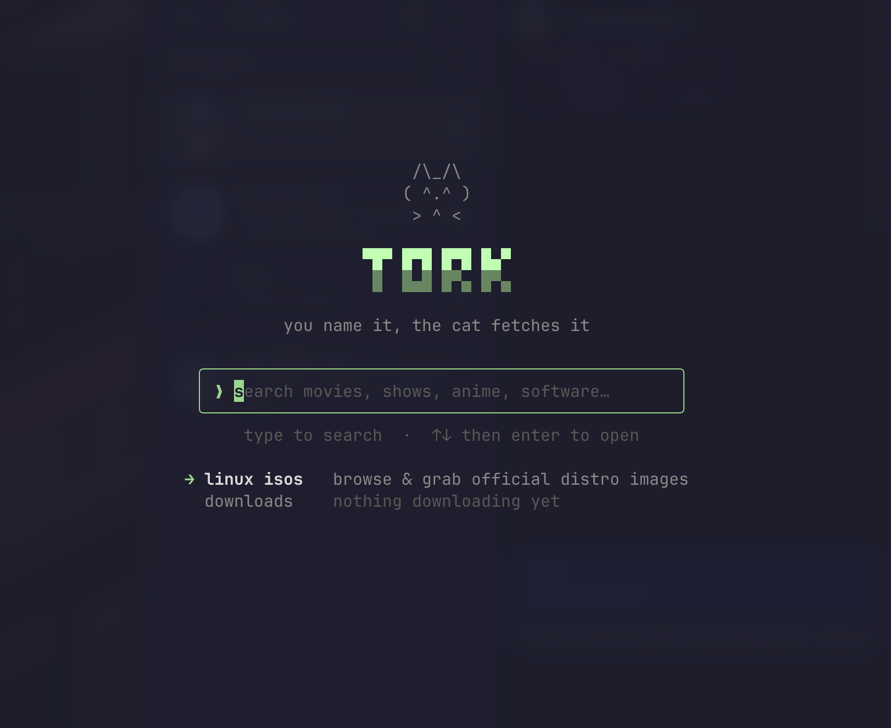

# tork

```
 /\_/\
( ^.^ )  a cozy terminal for torrent search + one-key linux isos
 > ^ <
```



Search Knaben, YTS, Nyaa (or any RSS/Torznab feed), rank the results, and
download over BitTorrent. Plus a shelf of official Linux ISOs (Ubuntu, Debian,
Fedora, Arch, NixOS, Proxmox, and more) resolved live and grabbed with one key.

## Install

```sh
brew tap melqtx/tap && brew install tork             # macOS (Homebrew)
yay -S tork                                          # Arch (AUR)
nix run github:melqtx/tork                           # Nix
go install github.com/melqtx/tork/cmd/tork@latest    # Go 1.26+
```

Config lives in `~/.tork/`; downloads land in `~/Downloads/tork` (change with
`tork -d DIR`).

## Keys

- **home** type to search, `↑↓` pick a destination, `enter` go
- **isos** `↑↓` browse, `enter` grab the latest official image
- **results** `enter` preview/get, `D` grab now, `/` filter, `o` sort, `v` graph
- **downloads** `p` pause/resume, `s` seed, `v` verify, `m` move, `r` relink, `x` remove, `d` delete data
- `tab` cycle, `esc` back, `^c` quit

## Autopilot (WIP)

Describe what you want and let the cat fetch it:

```sh
tork autopilot "all breaking bad seasons 1080p"      # also: --dry-run, -n N, --headless
```

## Legal

A client for public indexers and BitTorrent that hosts and indexes nothing. Use
it for lawful content: linux isos, public-domain media, your own files.

MIT, see [LICENSE](LICENSE).
